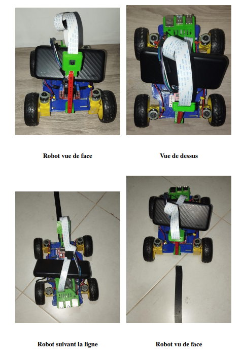
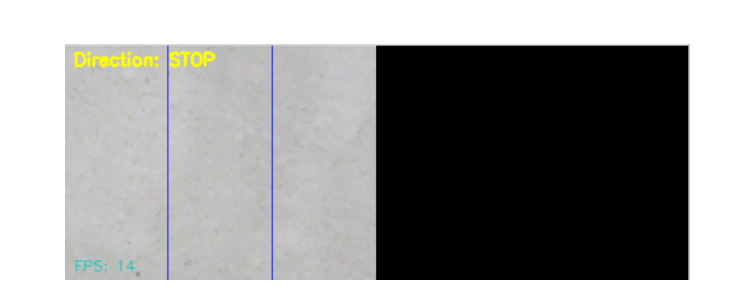
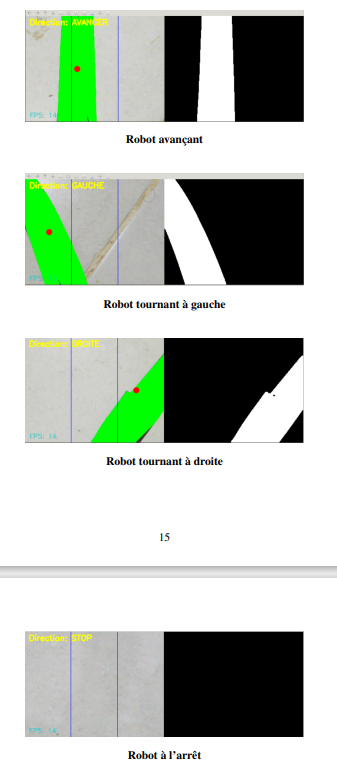
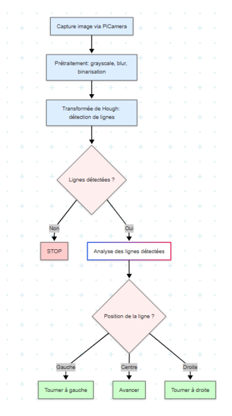

# 🤖 Autonomous Mobile Robot Using Computer Vision

An autonomous mobile robot system that uses computer vision and the Hough Transform algorithm for line detection and path following. This project demonstrates real-time image processing, autonomous navigation, and embedded systems integration using Raspberry Pi and OpenCV.

## 🎯 Project Overview

This project was developed as part of the Computer Vision module in the 2nd year of the Robotics and Cobotics Engineering program. It implements an autonomous mobile robot capable of following a trajectory using an onboard camera and computer vision algorithms, specifically the Hough Transform for line detection.

### Key Features

- **Real-time Line Detection**: Uses Hough Transform for robust line detection
- **Autonomous Navigation**: Self-guided movement without human intervention
- **Computer Vision Pipeline**: Complete image processing from capture to decision
- **Embedded System**: Raspberry Pi-based control system
- **Motor Control**: Precise 4-wheel drive control with L298N driver
- **Real-time Visualization**: Live display of processed images and robot status

## 🎓 Academic Context

- **Module**: OpenCV & Computer Vision
- **Supervisor**: M. AMMOUR Alae
- **Semester**: 08
- **Program**: 2nd Year Engineering Cycle in Robotics and Cobotics
- **Academic Year**: 2024/2025

## 🏗️ System Architecture

### Hardware Components

| Component | Description | Function |
|-----------|-------------|----------|
| **Raspberry Pi 4** | Main processing unit | Image processing, decision making, motor control |
| **PiCamera V2** | Vision sensor | Real-time image capture |
| **L298N Motor Driver** | H-bridge controller | Motor speed and direction control |
| **DC Motors (4x)** | Locomotion system | Four-wheel drive movement |
| **3D Printed Chassis** | Structural frame | Component mounting and stability |
| **Lithium Battery** | Motor power supply | Motor energy source |
| **Power Bank** | Raspberry Pi power | Stable power for processing unit |

### Software Stack

- **Python 3.x** - Main programming language
- **OpenCV** - Computer vision and image processing
- **NumPy** - Numerical computations and matrix operations
- **Picamera2** - Camera interface library
- **Raspberry Pi OS** - Operating system
- **Custom Motor Control Module** - Hardware abstraction layer

## 🚀 Installation & Setup

### Prerequisites

```bash
# Update system
sudo apt update && sudo apt upgrade -y

# Install Python dependencies
sudo apt install python3-pip python3-opencv python3-numpy

# Install camera support
sudo apt install python3-picamera2
```

## 🤖 Robot Hardware

### Robot Platform

This is the robot used in this project:



*The autonomous mobile robot featuring Raspberry Pi 4, PiCamera V2, L298N motor driver, and 3D-printed chassis with four-wheel drive system.*

### Robot in Operation

This is the robot with the lane detection system active:



*The robot actively following a white line on the ground, demonstrating the real-time line detection and navigation capabilities.*

## 🔄 Real-Time Processing

### Live Path Processing and Decision Making

This is the real-time path processing of the robot and decision making interface:



*Screenshot of the live processing interface showing the original camera feed, processed binary image, detected Hough lines, and current robot decision (FORWARD/LEFT/RIGHT/STOP).*

## 🎥 Video Demonstration

### Robot in Action

This is a video of the robot demonstration:


*Complete demonstration video showing the autonomous robot navigating various line patterns, making real-time decisions, and successfully following complex trajectories using Hough Transform-based computer vision.*

## 📋 Control Logic

### Robot Control Flowchart

This is the logic diagram of robot control:



*Detailed flowchart showing the complete decision-making process from image capture through line detection to motor control commands.*

## 📖 Detailed Documentation

### Complete Technical Specifications

For comprehensive technical details, hardware specifications, and implementation guide:

**[📄 Download Detailed Robot Documentation (PDF)](rapport_opencv.pdf)**

*This document contains complete technical specifications, assembly instructions, calibration procedures, and advanced configuration options.*

## 📞 Support & Contact

For all information, questions, help, or collaboration opportunities, feel free to contact me.

### Additional Support
- Open an issue on GitHub for technical problems
- Check the troubleshooting guide in `/docs`
- Refer to the detailed PDF documentation above
- Contact the academic supervisor for academic-related inquiries

I'm always happy to discuss this project, answer questions about the implementation, or collaborate on similar robotics and computer vision projects!
